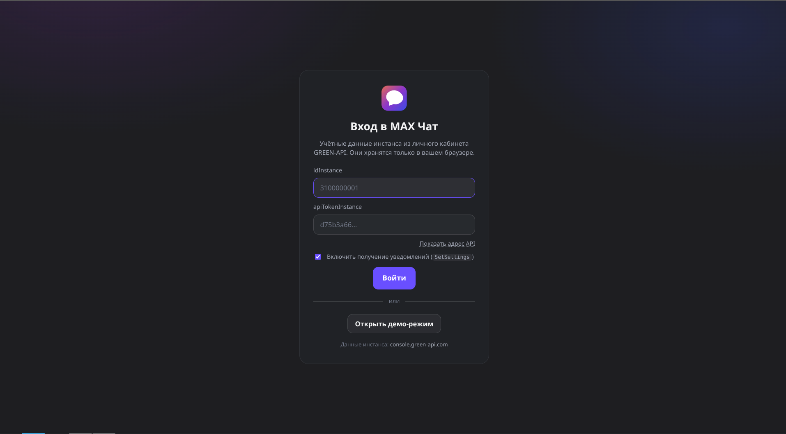
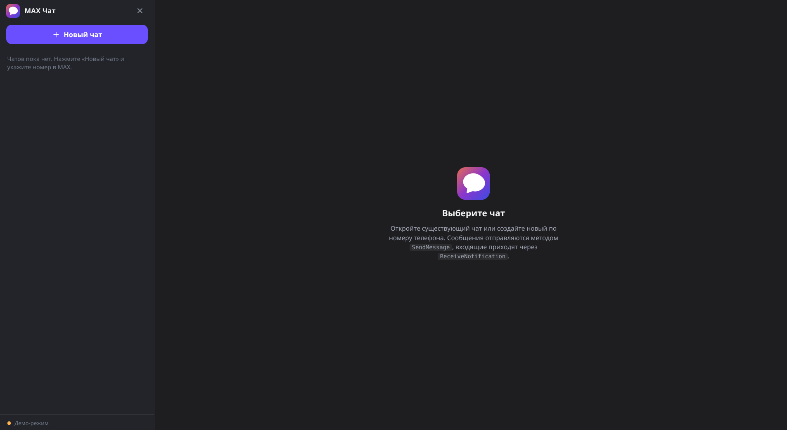
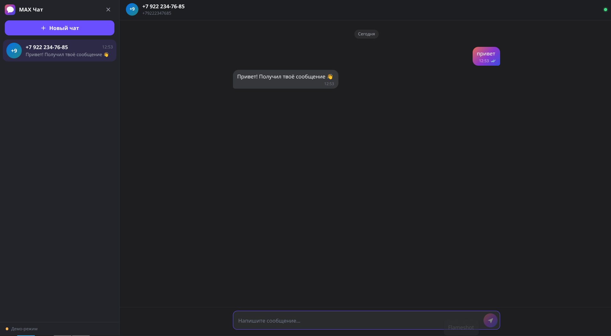
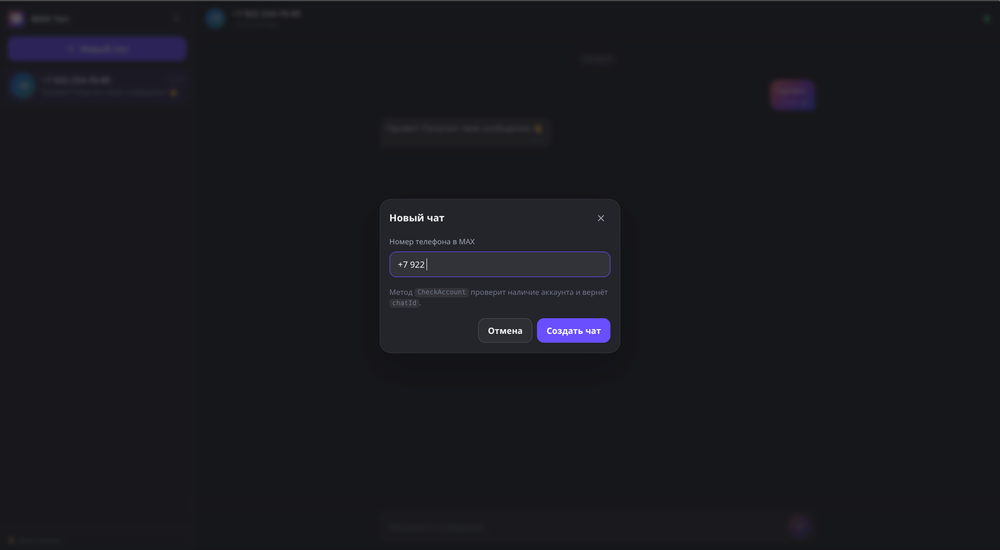
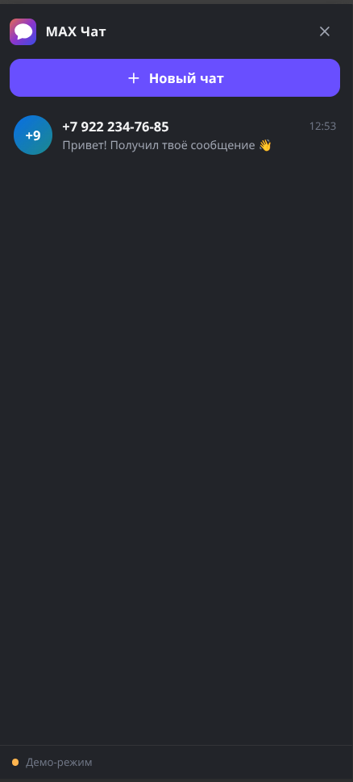
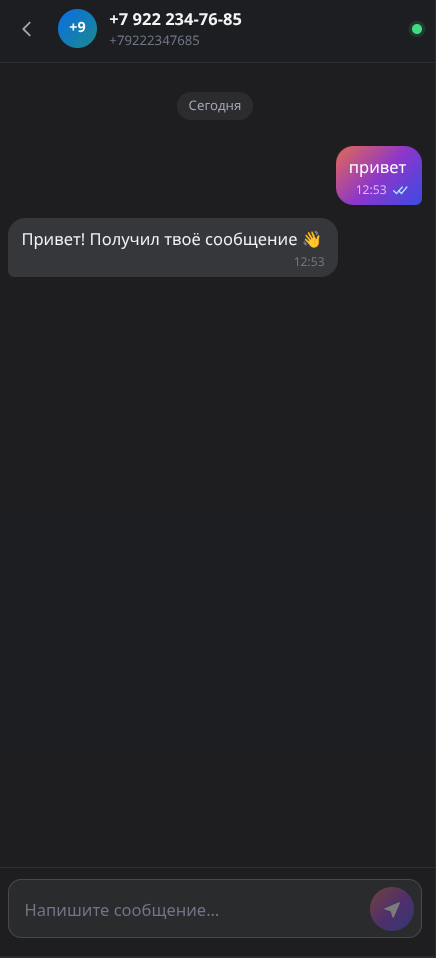

# MAX Чат — веб-интерфейс чата MAX на API GREEN-API

Тестовое задание: React-приложение, которое отправляет и принимает **текстовые**
сообщения мессенджера MAX через HTTP API GREEN-API.

Внешний вид повторяет `web.max.ru`: тёмная тема, градиентные пузыри исходящих
сообщений, скруглённая форма ввода, статусы доставки.

Приложение полностью клиентское — бэкенд не нужен.

**Инструкция по локальному запуску и разбор ошибок — в [INSTRUCTIONS.md](./INSTRUCTIONS.md).**

**[Демо в интернете →](https://khnykin-artem.github.io/test-task-hh/)**
— открывается в демо-режиме, учётные данные GREEN-API не нужны. Live-режим
работает только локально: в браузере запросы к `api.green-api.com` должны
пройти CORS-проверку, на статическом хостинге это не гарантировано.

---

## Возможности

- Вход по `idInstance` / `apiTokenInstance` из личного кабинета GREEN-API.
- **Демо-режим** — весь интерфейс работает без учётных данных: ответы
  собеседника генерируются локально, сетевых запросов нет.
- Создание чата по номеру телефона через `CheckAccount`.
- Отправка текстовых сообщений через `SendMessage`.
- Получение входящих сообщений через `ReceiveNotification`
  (long polling, `receiveTimeout=25`) с подтверждением через
  `DeleteNotification`.
- Статусы сообщений: часы (в отправке) → одна галочка (отправлено) →
  две галочки (прочитано), плюс состояние ошибки.
- Оптимистичная отправка: сообщение появляется в ленте мгновенно.
- Список чатов, непрочитанные, разделители дат, автопрокрутка.
- Русскоязычный интерфейс, адаптивная вёрстка для мобильных экранов.

## Скриншоты

Демо-режим, учётные данные GREEN-API не нужны.













## Требования

- Node.js `^20.19.0` или `>=22.12.0`
- npm

## Запуск

```bash
npm install
npm run dev
```

Приложение откроется на `http://localhost:5173`.

Чтобы посмотреть интерфейс без GREEN-API, нажмите **«Открыть демо-режим»**.

Полная инструкция с настройкой GREEN-API и разбором ошибок —
в [INSTRUCTIONS.md](./INSTRUCTIONS.md).

### Сборка

```bash
npm run build     # проверка типов + production-сборка в dist/
npm run preview   # локальный просмотр собранной версии
npm run typecheck # только проверка типов
```

## Используемые методы API

| Метод | Запрос | Назначение |
| --- | --- | --- |
| `GetStateInstance` | `GET .../{token}` | состояние авторизации инстанса |
| `SetSettings` | `POST .../{token}` | пустой `webhookUrl` + включение входящих/исходящих событий |
| `CheckAccount` | `POST .../{token}` + `{ phoneNumber }` | номер телефона → `chatId` |
| `SendMessage` | `POST .../{token}` + `{ chatId, message }` | отправка текста, ответ `{ idMessage }` |
| `ReceiveNotification` | `GET .../{token}?receiveTimeout=25` | получение уведомления, ответ `{ receiptId, body }` |
| `DeleteNotification` | `DELETE .../{token}/{receiptId}` | подтверждение обработки |

Обрабатываются события `incomingMessageReceived`, `outgoingApiMessage`,
`outgoingMessageStatus` и `stateInstance`.

## Как устроено получение сообщений

1. При входе вызывается `SetSettings` с пустым `webhookUrl`.
2. Запускается цикл: `ReceiveNotification` удерживает соединение до 25 секунд.
3. Полученное уведомление сразу подтверждается через `DeleteNotification`.
4. `incomingMessageReceived` превращается в сообщение в ленте;
   `outgoingMessageStatus` обновляет галочки.
5. Текст читается только из `messageData.textMessageData.textMessage` —
   вложения, голосовые и реакции игнорируются.

Сообщения дедуплицируются по `idMessage`, поэтому повторная доставка
уведомления не создаёт дубль в ленте.

## Структура проекта

```
src/
  api/
    greenApi.ts     клиент GREEN-API, интерфейс MessengerApi, разбор ошибок
    mockApi.ts      демо-режим с тем же интерфейсом MessengerApi
  components/       AuthScreen, ChatScreen, MessageList, MessageBubble,
                    Composer, NewChatDialog, ConnectionBanner, MaxLogo, Icons
  hooks/
    useSession.ts   сессия и учётные данные в localStorage
    useNotifications.ts  цикл ReceiveNotification / DeleteNotification
  store/
    chatStore.ts    состояние чатов и сообщений (редьюсер)
    webhook.ts      преобразование уведомлений в действия
  styles/
    max-theme.css   токены и стили темы MAX
  App.tsx           сборка приложения, отправка сообщений
  main.tsx          точка входа
```

## Технологии

React 19, TypeScript 5.9, Vite 8. Сторонних UI-библиотек нет — вся вёрстка
на CSS.

## Ограничения и допущения

- **Только текстовые сообщения**, лимит 4000 символов (счётчик появляется
  у 90% лимита).
- **Нет серверной части.** `apiTokenInstance` хранится в `localStorage`
  браузера. Для рабочего сервиса токен нужно хранить на бэкенде.
- **Вместо вебхуков используется long polling.** Круговой запрос с таймаутом
  25 секунд; при большой нагрузке лучше поднять свой вебхук.
- Прямые запросы к `api.green-api.com` из браузера рассчитаны на поддержку
  CORS, о которой заявляет официальный HTML5 SDK GREEN-API. Если CORS
  окажется закрыт, потребуется прокси на бэкенде.
- Интерфейс не хранит переписку на сервере: после выхода из аккаунта история
  чатов очищается, после перезагрузки — восстанавливается из активной сессии
  только текущий экран.